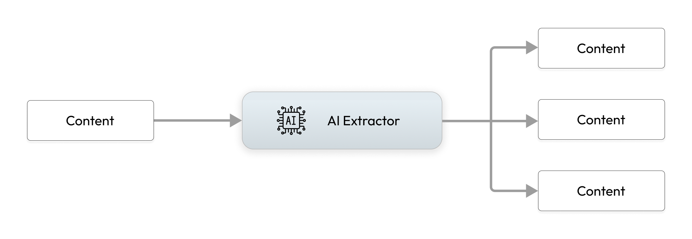

# Extractors

Extractors are used for structured extraction from un-structured data of any modality. For example, line items of an invoice as JSON, objects in a video, embedding of text in a PDF, etc. 

## Extractor Input and Ouput 

Extractors consume `Content` which contains the raw data and they product a list of Content which can either produce more content and features from them. For example, a PDF document can produce 10 `Content` each being a chunk of text and the corresponding embeddings of the chunk. There are no restrictions of how many features can be emitted by an extractor. 



Extractors are typically built from a AI model and some additional pre and post processing of content.
### Extractors Currently Available:
- Embedding Extractors
  `-ColBERT    - E5    - hash    - jina    - minilm    - mpnet    - scibert    - openai`

## Running Extractors

Extractors are packaged in docker containers so they can be tested locally for evaluation and also deployed in production with ease.

```shell
indexify extractor extract --name diptanu/minilm-l6-extractor --text "hello world"
```

## Developing a new Extractor

#### Start from a template

The following command will create a template for a new extractor in the current directory. 

```shell
indexify extractor new --name my-extractor --path my-extractor
```

#### Implement the Extractor 
The extractor code lives in python modules. The template creates a `MyExtractor` class in the `custom_extractor.py` file. Implement the extract method, which accepts a list of `Content` and prouduces a list of list of `Content`, since every content can hypothetically produce multiple content. The valid output features are `Embedding` and `JSON`. Chunks of document goes in the `Content` in the data payload of the `Content`. 

```python
def extract(self, content: List[Content]) -> List[List[Content]]:
    """
    Extracts features from content.
    """
    output: List[List[Content]] = []
    for cn in content:
        chunk_contents: List[Content] = []
        chunks = cn.chunk()
        for chunk in chunks:
            embedding = get_embedding(chunk)
            entities = run_ner_model(chunk)
            embed_chunk = Content.from_text(text=chunk, feature=Feature.embedding(name="text_embedding", value=embedding))
            metadata_chunk = Content.from_text(text=chunk, feature=Feature.metadata(name="metadata", json.dumps(entities))),
            chunk_contents.extend([embed_chunk, metadata_chunk])
        output.append(chunk_contents)
    return output
```

In this example we iterate over a list of content, chunk each content, run a NER model and an embedding model over each chunk and return them as features along with the chunks of text.

!!! note "Extractor Dependencies"

    Use any python or native system dependencies in your extractors because we can package them in a container to deploy them to production.

Implement the schemas method to contain the output schema of the extractor. Name each feature and provide the type of the feature. For embedding types use the `EmbeddingSchema` type, for any other metadata just use the json schema of the output feature.

```python
def schemas(cls) -> ExtractorSchema:
    """
    Returns schema of features for indexing.
    """
    return ExtractorSchema(
        features={"text_embedding": EmbeddingSchema(distance_metric="cosine", dim=3)},
    )
```

#### Test the extractor locally

Extractors are just python modules so you can write a unit test like any any other python module. You should also test the extractor using the indexify binary to make sure it works as expected. 

```shell
indexify extractor extract -e my-extractor/custom_extractor.py:MyExtractor --text "hello world"
```

#### Join with Control Plane
It's a good idea to test the behavior of the extractor with the Indexify Control Plane locally to make sure it works as expected. 

```shell
indexify extractor start -e my-extractor/indexify.yaml --control-plane-addr 172.21.0.2:8950
```

#### Update the extractor configuration
You can include the python and system dependencies of the extractor in the configuration file. Update the indexify.yaml file with the dependencies of the extractor. 

```yaml
name: my-extractor
version: 1
description: "Description of the Extractor goes here"
# Rename the file and the class name if you wish to
module: custom_extractor.py:MyExtractor
gpu: false
# Add all the python dependencies here which are required for the extractor to work
python_dependencies:
  - torch
# Add all the system dependencies here. We use a ubuntu base image, so the package names
# should be available in ubuntu
system_dependencies:
  - ffmpeg

```

#### Package the extractor
Once you have tested the package, pakcage it into a container. From here the extractor is deployable to any environment. You can share the extractor on our Hub for other developers to know about it! 

```shell
indexify extractor package -v -c my-extractor/indexify.yaml
```

The packaged extractors should also be visible as a docker container locally.
```shell
docker images
```

#### Test the packaged extractor

```shell
indexify extractor extractor --name your-name/indexify-extractor --text "hello world"
```

#### Deploy the extractor to production
Once the extractor is packaged, it can be deployed to any environment as long as the Indexify control plane can access it. Point the extractor to the production control plane and that's all! 
